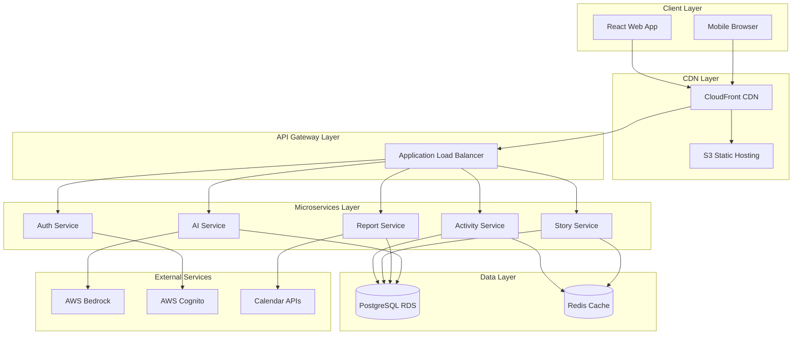

# Design Document

## Overview

Work Tracker is a modern web-based professional activity tracking system built with a microservices architecture. The system leverages React with TypeScript for the frontend, FastAPI microservices for the backend, PostgreSQL for data persistence, and AWS Bedrock for AI-powered content generation. The architecture follows proven patterns from the user's Conservation Biology Toolkit, adapted for professional activity management and AWS cloud deployment.

## Architecture

### High-Level Architecture



### Deployment Architecture

**Frontend Deployment:**
- React application built and deployed to S3 bucket
- CloudFront distribution for global CDN and HTTPS termination
- Route 53 for DNS management with custom domain

**Backend Deployment:**
- FastAPI microservices containerized with Docker
- ECS Fargate for serverless container orchestration
- Application Load Balancer for traffic distribution
- Auto Scaling Groups for high availability

**Data Layer:**
- PostgreSQL on RDS with Multi-AZ deployment
- Redis on ElastiCache for session and query caching
- S3 for file storage and backups

## Components and Interfaces

### Frontend Components

**Core Application Structure:**
```typescript
src/
├── components/           # Reusable UI components
│   ├── ActivityForm/    # Quick activity logging
│   ├── StoryEditor/     # STAR format story creation
│   ├── Dashboard/       # Main activity overview
│   └── ReportViewer/    # Generated report display
├── pages/               # Route-based page components
│   ├── Login/          # Authentication
│   ├── Activities/     # Activity management
│   ├── Stories/        # Story management
│   └── Reports/        # Report generation
├── services/           # API integration layer
├── hooks/              # Custom React hooks
├── utils/              # Helper functions
└── types/              # TypeScript definitions
```

**Key React Components:**

1. **ActivityForm Component**
   - Quick entry form with auto-complete
   - Category and tag selection
   - Real-time validation
   - Offline capability with sync

2. **StoryEditor Component**
   - STAR format template
   - AI-powered suggestions
   - Rich text editing
   - Progress tracking

3. **Dashboard Component**
   - Activity timeline view
   - Quick stats and metrics
   - Recent activities feed
   - Action shortcuts

4. **ReportViewer Component**
   - Generated report display
   - Export functionality (PDF/Word)
   - Edit and regenerate options
   - Sharing capabilities

### Backend Microservices

**1. Authentication Service**
```python
# FastAPI service for user management
@app.post("/auth/login")
async def login(credentials: LoginRequest) -> TokenResponse:
    # AWS Cognito integration
    pass

@app.post("/auth/refresh")
async def refresh_token(token: RefreshRequest) -> TokenResponse:
    # Token refresh logic
    pass
```

**2. Activity Service**
```python
# Core activity management
@app.post("/activities")
async def create_activity(activity: ActivityCreate) -> Activity:
    # Validate and store activity
    pass

@app.get("/activities")
async def list_activities(
    user_id: str,
    filters: ActivityFilters = Depends()
) -> List[Activity]:
    # Filtered activity retrieval
    pass
```

**3. Story Service**
```python
# Customer success story management
@app.post("/stories")
async def create_story(story: StoryCreate) -> Story:
    # STAR format validation and storage
    pass

@app.put("/stories/{story_id}/enhance")
async def enhance_story(story_id: str) -> Story:
    # AI-powered story improvement
    pass
```

**4. Report Service**
```python
# Report generation and management
@app.post("/reports/generate")
async def generate_report(request: ReportRequest) -> ReportResponse:
    # Coordinate with AI service for generation
    pass

@app.get("/reports/{report_id}/export")
async def export_report(report_id: str, format: str) -> FileResponse:
    # PDF/Word export functionality
    pass
```

**5. AI Service**
```python
# AWS Bedrock integration
@app.post("/ai/enhance-story")
async def enhance_story(content: StoryContent) -> EnhancedStory:
    # Bedrock Claude integration for story improvement
    pass

@app.post("/ai/generate-report")
async def generate_report(activities: List[Activity]) -> GeneratedReport:
    # Bedrock integration for report generation
    pass
```

## Data Models

### Core Entities

**User Model:**
```python
class User(BaseModel):
    id: UUID
    email: str
    name: str
    cognito_user_id: str
    preferences: Dict[str, Any]
    created_at: datetime
    updated_at: datetime
```

**Activity Model:**
```python
class Activity(BaseModel):
    id: UUID
    user_id: UUID
    title: str
    description: str
    category: ActivityCategory
    tags: List[str]
    impact_level: int  # 1-5 scale
    date: date
    duration_minutes: Optional[int]
    metadata: Dict[str, Any]  # Flexible JSON field
    created_at: datetime
    updated_at: datetime

class ActivityCategory(str, Enum):
    CUSTOMER_ENGAGEMENT = "customer_engagement"
    LEARNING = "learning"
    SPEAKING = "speaking"
    MENTORING = "mentoring"
    TECHNICAL_CONSULTATION = "technical_consultation"
    CONTENT_CREATION = "content_creation"
```

**Story Model:**
```python
class Story(BaseModel):
    id: UUID
    user_id: UUID
    title: str
    situation: str      # STAR format
    task: str          # STAR format
    action: str        # STAR format
    result: str        # STAR format
    impact_metrics: Dict[str, Any]
    tags: List[str]
    status: StoryStatus
    ai_enhanced: bool
    created_at: datetime
    updated_at: datetime

class StoryStatus(str, Enum):
    DRAFT = "draft"
    COMPLETE = "complete"
    PUBLISHED = "published"
```

**Report Model:**
```python
class Report(BaseModel):
    id: UUID
    user_id: UUID
    title: str
    period_start: date
    period_end: date
    report_type: ReportType
    content: str  # Generated markdown/HTML
    activities_included: List[UUID]
    stories_included: List[UUID]
    generated_by_ai: bool
    status: ReportStatus
    created_at: datetime

class ReportType(str, Enum):
    WEEKLY = "weekly"
    MONTHLY = "monthly"
    QUARTERLY = "quarterly"
    ANNUAL = "annual"
    CUSTOM = "custom"
```

### Database Schema

**PostgreSQL Tables:**
```sql
-- Users table
CREATE TABLE users (
    id UUID PRIMARY KEY DEFAULT gen_random_uuid(),
    email VARCHAR(255) UNIQUE NOT NULL,
    name VARCHAR(255) NOT NULL,
    cognito_user_id VARCHAR(255) UNIQUE NOT NULL,
    preferences JSONB DEFAULT '{}',
    created_at TIMESTAMP WITH TIME ZONE DEFAULT NOW(),
    updated_at TIMESTAMP WITH TIME ZONE DEFAULT NOW()
);

-- Activities table
CREATE TABLE activities (
    id UUID PRIMARY KEY DEFAULT gen_random_uuid(),
    user_id UUID REFERENCES users(id) ON DELETE CASCADE,
    title VARCHAR(500) NOT NULL,
    description TEXT,
    category VARCHAR(50) NOT NULL,
    tags TEXT[] DEFAULT '{}',
    impact_level INTEGER CHECK (impact_level >= 1 AND impact_level <= 5),
    date DATE NOT NULL,
    duration_minutes INTEGER,
    metadata JSONB DEFAULT '{}',
    created_at TIMESTAMP WITH TIME ZONE DEFAULT NOW(),
    updated_at TIMESTAMP WITH TIME ZONE DEFAULT NOW()
);

-- Stories table
CREATE TABLE stories (
    id UUID PRIMARY KEY DEFAULT gen_random_uuid(),
    user_id UUID REFERENCES users(id) ON DELETE CASCADE,
    title VARCHAR(500) NOT NULL,
    situation TEXT NOT NULL,
    task TEXT NOT NULL,
    action TEXT NOT NULL,
    result TEXT NOT NULL,
    impact_metrics JSONB DEFAULT '{}',
    tags TEXT[] DEFAULT '{}',
    status VARCHAR(20) DEFAULT 'draft',
    ai_enhanced BOOLEAN DEFAULT FALSE,
    created_at TIMESTAMP WITH TIME ZONE DEFAULT NOW(),
    updated_at TIMESTAMP WITH TIME ZONE DEFAULT NOW()
);

-- Reports table
CREATE TABLE reports (
    id UUID PRIMARY KEY DEFAULT gen_random_uuid(),
    user_id UUID REFERENCES users(id) ON DELETE CASCADE,
    title VARCHAR(500) NOT NULL,
    period_start DATE NOT NULL,
    period_end DATE NOT NULL,
    report_type VARCHAR(20) NOT NULL,
    content TEXT,
    activities_included UUID[] DEFAULT '{}',
    stories_included UUID[] DEFAULT '{}',
    generated_by_ai BOOLEAN DEFAULT FALSE,
    status VARCHAR(20) DEFAULT 'draft',
    created_at TIMESTAMP WITH TIME ZONE DEFAULT NOW()
);

-- Indexes for performance
CREATE INDEX idx_activities_user_date ON activities(user_id, date DESC);
CREATE INDEX idx_activities_category ON activities(category);
CREATE INDEX idx_activities_tags ON activities USING GIN(tags);
CREATE INDEX idx_stories_user_status ON stories(user_id, status);
CREATE INDEX idx_reports_user_type ON reports(user_id, report_type);
```

## Correctness Properties

*A property is a characteristic or behavior that should hold true across all valid executions of a system—essentially, a formal statement about what the system should do. Properties serve as the bridge between human-readable specifications and machine-verifiable correctness guarantees.*

### Property-Based Testing Overview

The Work Tracker system will be validated using property-based testing to ensure correctness across all possible inputs and scenarios. Each property represents a universal rule that must hold for all valid system states and operations.

### Core Properties

**Property 1: Activity Lifecycle Consistency**
*For any* valid activity data submitted by a user, the system should successfully validate, store, and retrieve the activity with all original data intact, completing the operation within the specified time constraints.
**Validates: Requirements 1.2, 1.4**

**Property 2: Auto-complete Suggestion Accuracy**
*For any* partial activity title input, if matching previous activities exist, the system should return relevant suggestions that contain the input as a substring.
**Validates: Requirements 1.3**

**Property 3: Activity Display and Filtering**
*For any* collection of user activities, the display system should correctly group activities by date and apply filters such that filtered results contain only activities matching the specified criteria.
**Validates: Requirements 1.5, 4.3**

**Property 4: Story Enhancement and Validation**
*For any* story content submitted to the AI service, the system should return enhancement suggestions and validate completeness according to STAR format requirements.
**Validates: Requirements 2.2, 2.3, 2.5**

**Property 5: Story Management Operations**
*For any* collection of user stories, the search and filtering operations should return only stories that match the specified search terms or filter criteria.
**Validates: Requirements 2.4**

**Property 6: Report Generation Completeness**
*For any* set of user activities within a specified time period, the AI service should generate a structured report that includes activity summaries, categorized groupings, and impact metrics derived from the input data.
**Validates: Requirements 3.1, 3.2, 4.4**

**Property 7: Report Export Functionality**
*For any* generated report, the export system should produce valid PDF and Word documents that contain all report content in the specified format.
**Validates: Requirements 3.4**

**Property 8: Tag Management Consistency**
*For any* tag operation (creation, suggestion, merge, rename, delete), the system should maintain tag consistency across all activities and provide appropriate suggestions based on existing tag data.
**Validates: Requirements 4.2, 4.5**

**Property 9: Authentication Token Validation**
*For any* valid user credentials, the authentication system should generate secure session tokens that allow access to user-specific resources and reject invalid or expired tokens.
**Validates: Requirements 5.2**

**Property 10: Data Export Completeness**
*For any* user's data collection, the export system should generate a comprehensive JSON package that includes all activities, stories, and metadata with complete data preservation and provide secure download access.
**Validates: Requirements 6.1, 6.2, 6.3, 6.4**

**Property 11: Cross-Device Data Synchronization**
*For any* data modification made on one device, the same data should be consistently available and up-to-date when accessed from any other authenticated device.
**Validates: Requirements 7.3**

**Property 12: Offline Data Caching**
*For any* recent user data, when the application goes offline, the cached data should remain accessible and any modifications should sync correctly when connectivity is restored.
**Validates: Requirements 7.4**

**Property 13: Calendar Integration Workflow**
*For any* calendar event processed by the integration system, the AI service should generate appropriate activity suggestions that can be accepted, modified, or rejected by the user.
**Validates: Requirements 8.1, 8.2, 8.3**

## Error Handling

### Error Categories and Responses

**1. Validation Errors**
- Invalid activity data: Return structured error messages with field-specific validation failures
- Incomplete story data: Highlight missing STAR format sections with guidance
- Authentication failures: Clear error messages with retry options

**2. Service Unavailability**
- AWS Bedrock service errors: Graceful degradation with manual alternatives
- Database connection issues: Retry logic with exponential backoff
- Calendar integration failures: Manual entry alternatives with clear error messages

**3. Performance Issues**
- Slow network conditions: Progressive loading indicators and optimized payloads
- Large data exports: Chunked processing with progress indicators
- High concurrent usage: Rate limiting with user-friendly messages

**4. Data Integrity**
- Concurrent modification conflicts: Last-write-wins with user notification
- Export generation failures: Detailed error messages with support contact
- Sync conflicts: Conflict resolution with user choice options

### Error Recovery Strategies

**Automatic Recovery:**
- Network timeouts: Automatic retry with exponential backoff (max 3 attempts)
- Temporary service unavailability: Circuit breaker pattern with fallback options
- Session expiration: Automatic token refresh with seamless user experience

**User-Initiated Recovery:**
- Manual retry options for failed operations
- Data re-sync capabilities for offline conflicts
- Export regeneration for failed downloads

## Testing Strategy

### Dual Testing Approach

The Work Tracker system will employ both unit testing and property-based testing to ensure comprehensive coverage and correctness validation.

**Unit Tests:**
- Verify specific examples and edge cases
- Test integration points between microservices
- Validate error conditions and boundary cases
- Focus on concrete scenarios and known failure modes

**Property-Based Tests:**
- Verify universal properties across all inputs using randomized test data
- Minimum 100 iterations per property test for statistical confidence
- Each property test references its corresponding design document property
- Tag format: **Feature: work-tracker, Property {number}: {property_text}**

### Testing Framework Selection

**Frontend Testing:**
- **Jest + React Testing Library** for unit tests
- **fast-check** for property-based testing in TypeScript
- **Cypress** for end-to-end integration testing

**Backend Testing:**
- **pytest** for unit tests with FastAPI test client
- **Hypothesis** for property-based testing in Python
- **pytest-asyncio** for async operation testing

### Property Test Configuration

Each correctness property will be implemented as a property-based test with the following configuration:
- **Minimum iterations:** 100 per test
- **Timeout:** 30 seconds per property test
- **Data generation:** Smart generators that create realistic test data within valid input domains
- **Shrinking:** Automatic minimization of failing test cases for easier debugging

### Test Data Generation Strategy

**Smart Generators:**
- Activity generators: Create realistic activities with valid categories, dates, and descriptions
- Story generators: Generate STAR-format stories with varying completeness levels
- User data generators: Create consistent user profiles with associated activities and stories
- Calendar event generators: Generate realistic meeting data for integration testing

**Edge Case Coverage:**
- Empty and null inputs
- Maximum length strings and data structures
- Boundary date values (past/future limits)
- Special characters and internationalization
- Large data sets for performance validation

### Continuous Integration Testing

**Pre-deployment Validation:**
- All unit tests must pass (100% success rate)
- All property tests must pass across multiple random seeds
- Integration tests must validate microservice communication
- Performance tests must meet response time requirements (< 2 seconds for API calls)

**Production Monitoring:**
- Health checks for all microservices
- Performance monitoring with alerting
- Error rate tracking with automatic rollback triggers
- User experience monitoring with real user metrics